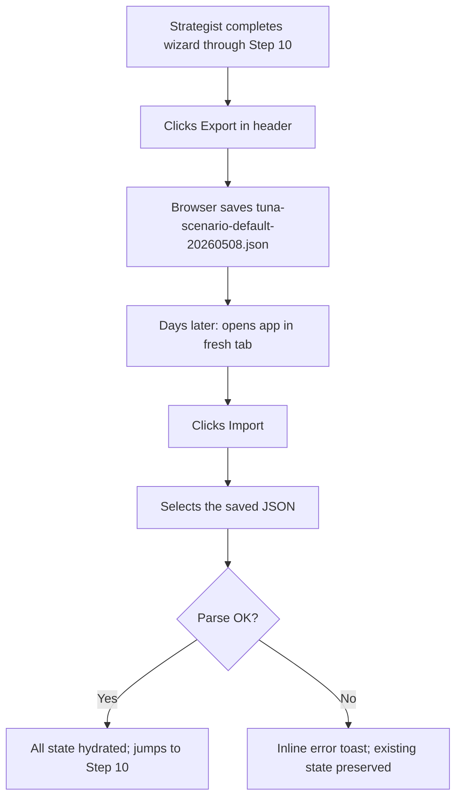
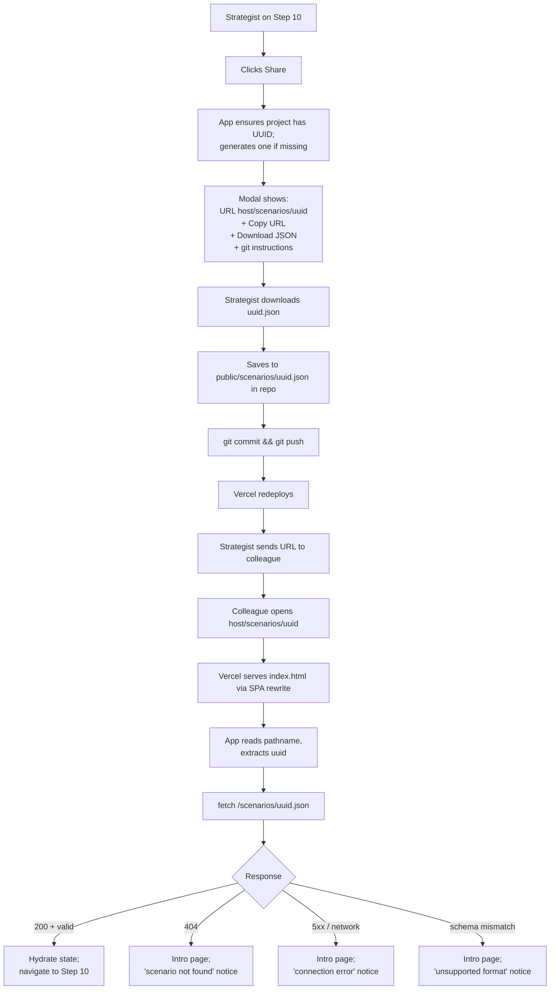
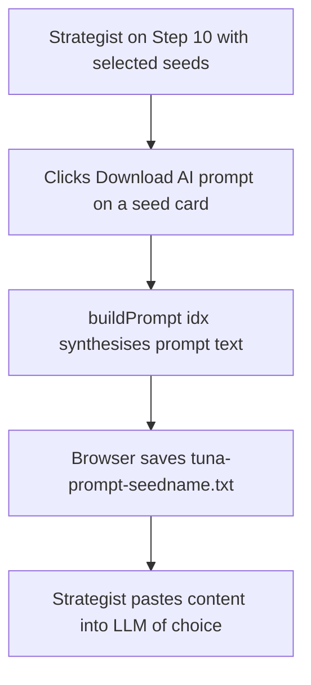
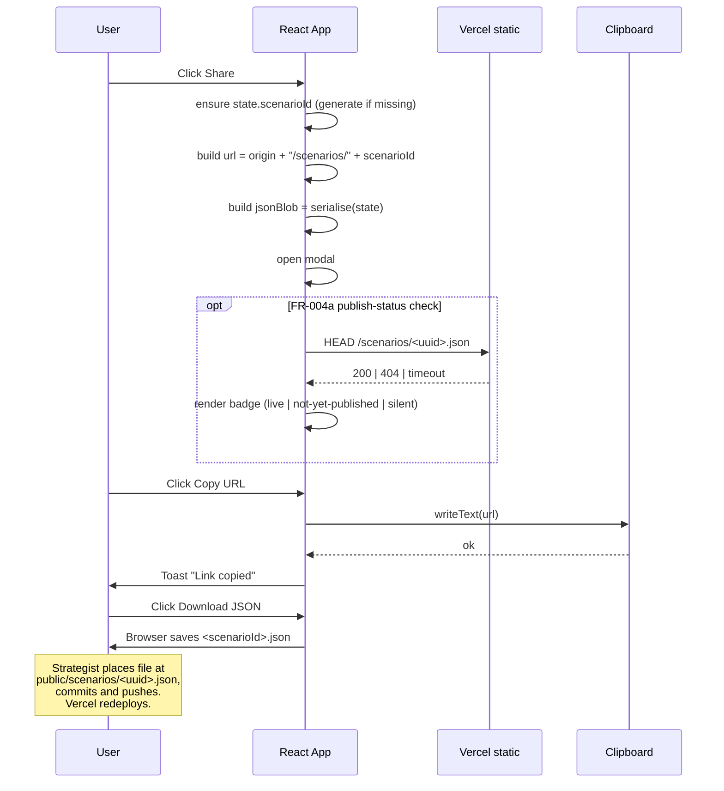
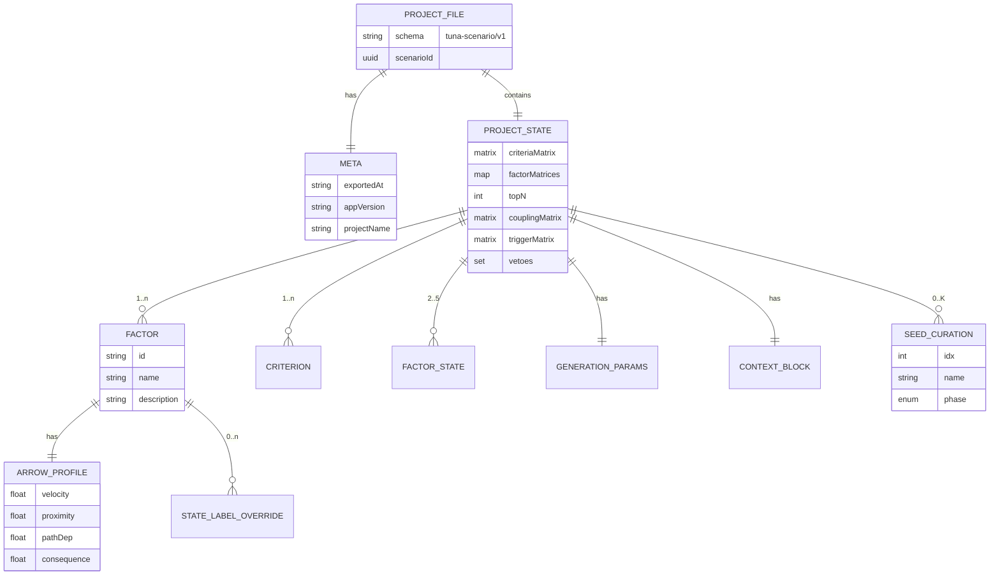

# Scenario Portability and Brand Refresh — Specification

**Created:** 2026-05-08
**Status:** Draft
**Author:** AI-assisted (Claude) with Peter Verster
**Target file:** `tuna-scenario-tool.jsx` (prototype is preserved; no hexagonal refactor in this PR)
**Brand source:** `_brief/Brand-GuidelinesV4.pdf` (Peter Verster Brand Guidelines v4, December 2025)

---

## 1. Overview & Context

### 1.1 Purpose & Business Value

Three concurrent upgrades to the existing prototype, scoped to ship together because they share the same touchpoints (header chrome, app-level state, build/deploy):

1. **Scenarios as portable artefacts** — a strategist's project state (factors, criteria, matrices, arrows, coupling, generated seeds, names, phases) becomes an exportable, importable, shareable unit. Before this change, all work is ephemeral and lives in React state until the tab closes. Sharing is implemented via **UUID-named static JSON files** that the strategist commits to the repo's `public/scenarios/` directory and publishes by pushing to git — Vercel auto-deploys, and the file becomes accessible at `/scenarios/<uuid>.json`. The shareable URL `<host>/scenarios/<uuid>` then loads it. This deliberately avoids URL-fragment encoding, compression, and any backend; the same UUID-based URL contract will later resolve to blob storage when persistence infrastructure exists.
2. **AI prompt export** — restores the per-seed "Download AI prompt" behaviour previously committed in `85a5bc4` and subsequently regressed. Currently the app POSTs to `api.anthropic.com` from the browser, which fails without exposing a key. Until a backend exists, the right placeholder is a `.txt` download containing the same prompt.
3. **Brand alignment** — apply the Peter Verster Brand Guidelines v4: replace the slate/amber palette with brand Fire Orange / Slate / Signal accents, swap typography to Inter + Noto Sans Mono, and produce a written style guide so subsequent design work has a reference.

The combined effect is to turn the prototype from a single-session demo into something a strategist can actually use across sessions, share with clients, and present with credible visual identity.

### 1.2 Stakeholders

| Stakeholder | Interest | Impact |
|---|---|---|
| Peter (owner / strategist) | Owns the brand; uses the tool to produce client deliverables | High |
| Workshop participants | Receive shared scenarios as deep links during/after sessions | Medium |
| Investors / advisory clients | Receive scenario artefacts with consistent brand presentation | Medium |
| Future implementer (post-prototype) | Inherits a JSON schema and brand tokens that survive a hexagonal refactor | High |

### 1.3 Scope

**In scope (this PR):**
- Project export to JSON (file download), filename `<uuid>.json`.
- Project import from JSON (file picker).
- Each project carries a stable UUID (generated lazily on first export/share).
- Share-via-link: a modal that displays the public URL `<host>/scenarios/<uuid>` and provides the JSON file the strategist must place in `public/scenarios/<uuid>.json` and push to git.
- App-boot URL routing: when the path is `/scenarios/<uuid>`, fetch `/scenarios/<uuid>.json` and hydrate.
- A `public/scenarios/` directory with a placeholder `README.md` and (optionally) a sample scenario file the strategist can use as a smoke test.
- Schema versioning (`schema: "tuna-scenario/v1"`) for future migration.
- Per-seed AI prompt export as `.txt` download. Removal of the in-browser `fetch` to `api.anthropic.com`.
- Brand token application: colors, typography, font loading.
- `_docs/style-guide.md` covering palette, type scale, components, do/don't, contrast notes.
- Updated favicon and document title using the brand wordmark.

**Out of scope (deferred):**
- Hexagonal refactor of `tuna-scenario-tool.jsx` into the target architecture (per `_domain/ARCHITECTURE.md`). The prototype is preserved.
- Server-side persistence, blob storage retrieval, and account-based scenario library. (The UUID URL contract is designed to be drop-in compatible with these later.)
- Automated publishing — the strategist places the file in `public/scenarios/` and commits it manually. No "Publish" button that pushes to git from the browser.
- URL-fragment encoding / lz-string compression / any in-URL state payload. (Explicitly rejected in favour of UUID indirection.)
- Server-side AI generation backend.
- Multi-user collaboration / real-time editing.
- Light-mode theme variant (dark mode only in this PR).
- Full visual identity expression: gradient backgrounds, generative data lines, particle systems, signal-category iconography, horizon-line motifs (deferred to a later "visual expression" phase).
- Live in-app `/style-guide` route. (Style guide lives in markdown only.)
- Migration logic for `tuna-scenario/v0` (no v0 exists; v1 is the first schema).
- Access control on scenario JSON files — they are publicly readable once published, by design (static hosting). Acknowledged risk; private scenarios are out of scope until a backend exists.
- Strategy wind-tunnelling, narrative authoring, or any concern listed in `_domain/BOUNDED_CONTEXTS.md` as outside the scenario-generation context.

### 1.4 Success Criteria

- [ ] User can complete the wizard, click Export, and receive `<uuid>.json` containing all project state plus the UUID itself.
- [ ] User can click Import, choose a previously-exported file, and the wizard hydrates to the exact same selected seed set, scores, and arrival windows (re-deriving the matrices is sufficient — round-trip equality of derived values is not required).
- [ ] User can click Share, see the URL `<host>/scenarios/<uuid>`, copy it, and download the matching JSON file. The modal includes one-line guidance: "save as `public/scenarios/<uuid>.json` and push to git to publish."
- [ ] After the strategist commits a file at `public/scenarios/<uuid>.json` and Vercel redeploys, opening `<host>/scenarios/<uuid>` in any browser fetches the JSON and renders the project at Step 10.
- [ ] When the JSON file does not exist (404), the recipient sees an inline notice: "scenario `<uuid>` not found"; the default fixture loads as a fallback.
- [ ] Each selected seed has a "Download AI prompt" button that produces a `.txt` file with the prompt; no network calls are made.
- [ ] All Tailwind classes referencing `amber-*` accent semantics are replaced with brand-tokenised equivalents; no `slate-950 / slate-900 / slate-800 / slate-100` triad remains in component code (use brand tokens instead).
- [ ] Inter and Noto Sans Mono load successfully and render in the appropriate roles. No Fraunces, IBM Plex Sans, or JetBrains Mono references remain.
- [ ] `_docs/style-guide.md` exists and covers: palette (with hex + usage notes + WCAG contrast call-outs), type scale, button/card/slider/badge specs, do/don't examples.
- [ ] Production bundle (`npm run build`) ≤ 260 KB gzipped (current: 76 KB; allow headroom for Inter font; no lz-string).
- [ ] `npm run build` succeeds with no warnings.
- [ ] Manual smoke test: full wizard run on the default fixture → export → import in a clean tab → identical selected seeds and arrival windows.
- [ ] Manual smoke test: place a sample `<uuid>.json` in `public/scenarios/`, run dev server, navigate to `/scenarios/<uuid>`, scenario loads.

### 1.5 Dependencies

| Dependency | Type | Status |
|---|---|---|
| `tuna-scenario-tool.jsx` (existing prototype) | Modified | Exists |
| `tailwind.config.js` | Modified | Exists |
| `src/index.css` | Modified | Exists |
| `index.html` | Modified (font preload, favicon, title) | Exists |
| `vercel.json` | Verified — existing SPA rewrite already supports `/scenarios/<uuid>`; static `.json` files served before rewrite kicks in | Exists |
| `public/scenarios/` directory | Created with `README.md` | New |
| `crypto.randomUUID()` (browser-native) | Used; no library needed | Browser API |
| Inter font | Loaded via Google Fonts or self-hosted | New |
| Noto Sans Mono font | Loaded via Google Fonts or self-hosted | New |
| `_brief/Brand-GuidelinesV4.pdf` | Reference | Exists |
| `_domain/UBIQUITOUS_LANGUAGE.md` | Reference (terminology) | Exists |

---

## 2. User Perspective

### 2.1 User Stories

#### US-001: Export a project to a file

> As a **strategist**, I want to **export my completed project as a JSON file**, so that **I can save it locally, version it in git, or send it to a collaborator**.

**Acceptance criteria:**
- [ ] An "Export" button is visible in the persistent header at all wizard steps (including the intro).
- [ ] If the project does not yet have a UUID, one is generated (via `crypto.randomUUID()`) and stored in state at the moment of export.
- [ ] Clicking Export downloads `<uuid>.json` (e.g. `8f4c2a1d-b6e3-4d9f-9a1c-2e8b7c5f3a90.json`).
- [ ] The file is valid JSON conforming to schema `tuna-scenario/v1`, with `scenarioId` equal to the project's UUID and `meta.projectName` carrying the optional human-readable name.
- [ ] The file contains every piece of user-controlled state: factors, criteria, criteria pairwise matrix, factor pairwise matrices, top-N, arrows, states, state label overrides, coupling matrix, trigger matrix, vetoes, generation parameters (K, α, φ, τ), seed names, seed phases, purpose, audience, documents.
- [ ] Subsequent exports reuse the same UUID — exporting twice produces the same filename (overwrites cleanly when saved).

#### US-002: Import a project from a file

> As a **strategist**, I want to **import a previously exported project file**, so that **I can resume work or load a colleague's analysis**.

**Acceptance criteria:**
- [ ] An "Import" button is visible in the persistent header alongside Export.
- [ ] Clicking Import opens a native file picker accepting `.json`.
- [ ] On successful parse + schema validation, the wizard hydrates all state and navigates to Step 10 (Seeds) so the user immediately sees the result.
- [ ] On parse failure, schema mismatch, or unsupported `schema` version, an inline error toast explains the problem and the existing state is preserved (no destructive load on bad input).
- [ ] If the file is from an unknown future schema (e.g. `tuna-scenario/v2`), the error is "this file was created by a newer version of the tool" rather than a generic parse error.

#### US-003: Share a project via UUID URL

> As a **strategist**, I want to **share my project as a stable URL backed by a JSON file in my repo**, so that **a colleague can open it instantly and I retain a versioned, audit-able copy in git**.

**Acceptance criteria:**
- [ ] A "Share" button is visible in the persistent header alongside Export/Import.
- [ ] Clicking Share opens a modal that contains:
  - The public URL `https://<host>/scenarios/<uuid>` (read-only text field).
  - A "Copy URL" button.
  - A "Download JSON" button (downloads `<uuid>.json`).
  - A short instructional block: "To publish: save the JSON as `public/scenarios/<uuid>.json` in this repo, commit, and push. Vercel will redeploy and your URL will be live."
  - The detected `<host>` (defaults to `window.location.origin`; falls back to a configurable default for local dev — see Q-007).
- [ ] No HTTP request is made when generating the share URL — it's a pure string concatenation against the project's UUID.
- [ ] The same UUID and JSON file are used for both Export and Share — exporting then sharing produces matching artefacts.

#### US-004: Open the app via a UUID URL

> As a **recipient of a shared URL**, I want to **click the URL and see the scenario immediately**, so that **I can engage without setup or installation**.

**Acceptance criteria:**
- [ ] On app boot, the app inspects `window.location.pathname`. If it matches `/scenarios/<uuid>`, the app issues `fetch("/scenarios/<uuid>.json")`.
- [ ] On HTTP 200 + valid JSON + valid schema, the app hydrates state and navigates to Step 10. The address bar URL stays `<host>/scenarios/<uuid>` (kept for refresh and share-back ergonomics).
- [ ] On HTTP 404, the user sees the intro page with an inline notice: "Scenario `<uuid>` not found. It may have been removed, or the publisher hasn't pushed it yet." Default fixture loads.
- [ ] On HTTP 5xx or network failure, similar handling with message: "Couldn't load scenario `<uuid>`. Check your connection and try again."
- [ ] On schema mismatch (file fetched but malformed/wrong version), inline notice: "Scenario `<uuid>` is in an unsupported format." Default fixture loads.
- [ ] After successful hydration, the URL is preserved (refresh re-fetches and reloads cleanly).

#### US-005: Export AI prompt for a selected seed

> As a **strategist**, I want to **download the AI prompt for each selected seed as a `.txt` file**, so that **I can paste it into Claude, ChatGPT, or any LLM of my choice without exposing API keys**.

**Acceptance criteria:**
- [ ] In Step 10, each selected seed card has a "Download AI prompt" button (replacing the current "Generate with AI" button).
- [ ] Clicking it downloads `tuna-prompt-<seed-name-or-index>.txt`.
- [ ] The `.txt` contains the same prompt structure currently built by `buildPrompt(idx)` (no functional change to prompt content in this PR).
- [ ] No network call to `api.anthropic.com` or any other host is made.
- [ ] If the user has not yet given the seed a name, the filename uses `seed-<idx+1>` (1-indexed).

#### US-006: See brand-aligned visual identity

> As a **strategist**, I want **the tool to reflect the Peter Verster brand**, so that **client-facing screen-shares and screenshots are consistent with my other materials**.

**Acceptance criteria:**
- [ ] Inter is used for all UI text. Noto Sans Mono is used for monospace content (numerical readouts, badges, mnemonic IDs).
- [ ] Fire Orange `#ff3a05` is the primary accent (replacing amber-500).
- [ ] Surfaces use brand Slate `#2e2e36` instead of slate-900.
- [ ] The Signal accent palette is used for semantic categories: Advisory `#4b9875` (success/positive), Thought `#f0c22e` (warning/caution), Book `#76b1d2` (info/neutral), Press `#f47a49` (danger), Speaking `#8371dc` (special highlight).
- [ ] The favicon and document title reflect the wordmark and "TUNA Scenario Selector — Peter Verster" naming.
- [ ] Contrast ratios on all body text meet WCAG 2.1 AA.

#### US-007: Reference a written style guide

> As a **future implementer or designer**, I want a **canonical written style guide**, so that **subsequent UI work stays consistent with the brand**.

**Acceptance criteria:**
- [ ] `_docs/style-guide.md` exists.
- [ ] It documents: the palette (hex, role, usage examples), the type scale (font, weight, size, line-height per role), the component primitives (buttons, cards, sliders, badges, inputs), do/don't visual examples, and contrast/accessibility notes.
- [ ] Each colour in the palette has at least one tested foreground/background contrast ratio annotated.

### 2.2 User Workflows

#### Workflow 1 — Export and re-import (full round trip)



#### Workflow 2 — Share via UUID URL (publish-by-git)



#### Workflow 3 — Per-seed AI prompt download



### 2.3 UI/UX Requirements

- All new buttons live in the persistent header bar alongside the existing Reset and About controls. Order: **About** · **Import** · **Export** · **Share** · **Reset**.
- The Share modal is a centred overlay with backdrop. Closes on Escape, on backdrop click, and on a top-right close button.
- The "Download AI prompt" button on each seed card replaces the current "Generate with AI" CTA. Same position, same prominence.
- All buttons keyboard-accessible; modal traps focus while open.
- Toast notifications use the bottom-right corner, auto-dismiss after 4 s.
- WCAG 2.1 AA throughout (contrast, keyboard nav, focus indicators).

---

## 3. Behavioral Perspective

### 3.1 Functional Requirements

#### FR-001: Project schema definition

- **Description:** A canonical JSON schema for serialising all project state.
- **Schema identifier:** `"tuna-scenario/v1"`.
- **Shape:**
  ```json
  {
    "schema": "tuna-scenario/v1",
    "scenarioId": "uuid v4 — generated by crypto.randomUUID() on first export/share",
    "meta": {
      "exportedAt": "ISO-8601 UTC timestamp",
      "appVersion": "<git-short-sha or package version>",
      "projectName": "string (default: 'Untitled')"
    },
    "project": {
      "factors":              [{ "id": "string", "name": "string", "description": "string" }, ...],
      "criteria":             [{ "id": "string", "name": "string", "description": "string" }, ...],
      "criteriaMatrix":       [[number, ...], ...],
      "factorMatrices":       { "<criterionId>": [[number, ...], ...] },
      "topN":                 number,
      "factorArrows":         { "<factorId>": { "velocity": number, "proximity": number, "pathDep": number, "consequence": number } },
      "factorStates":         [{ "value": number, "label": "string" }, ...],
      "stateLabelOverrides":  { "<factorId>": { "<stateIndex>": "string" } },
      "couplingMatrix":       [[number, ...], ...],
      "triggerMatrix":        [[0|1, ...], ...],
      "vetoes":               ["<vetoKey>", ...],
      "generation": { "K": number, "alpha": number, "convergenceFocus": number, "coherenceThreshold": number },
      "seedNames":            { "<idx>": "string" },
      "seedPhases":           { "<idx>": "Pre" | "Mid" | "Post" | "Steady" },
      "context": {
        "purpose":            "string",
        "audiencePreset":     "string",
        "audienceCustom":     "string",
        "documents":          [{ "id": "string", "name": "string", "content": "string", "included": boolean }, ...]
      }
    }
  }
  ```
- **Validation:** `scenarioId` must match the regex `^[0-9a-f]{8}-[0-9a-f]{4}-4[0-9a-f]{3}-[89ab][0-9a-f]{3}-[0-9a-f]{12}$` (UUID v4). All matrices must be square. Coupling must be symmetric with zero diagonal. Trigger entries must be 0 or 1 with zero diagonal. Pairwise entries must be in `{1/9, 1/8, ..., 1/2, 1, 2, ..., 9}`. Arrow scalars in `[0,1]` (consequence in `[-1,1]`).
- **Tolerances on import:** Out-of-range values clamp to nearest valid value with a console warning; structural violations (non-square matrices, missing required keys, missing/malformed `scenarioId`) reject the import.

#### FR-002: Export to file

- **Description:** Serialise current state to `tuna-scenario/v1` JSON and trigger a Blob download.
- **Input:** Current React state (no parameters).
- **Output:** `<scenarioId>.json` Blob, MIME `application/json`.
- **UUID lifecycle:** If `state.scenarioId` is not yet set, generate one via `crypto.randomUUID()` and persist it in state before serialising. The same UUID is reused for subsequent exports (idempotent filename).
- **Filename rationale:** UUID-only filename matches the static path the strategist will commit to (`public/scenarios/<uuid>.json`) — copy-paste with no renaming. Human-readable project names live inside `meta.projectName`, not the filename.

#### FR-003: Import from file

- **Description:** Parse a user-selected file and hydrate state.
- **Input:** A `File` object from the file picker (`.json`, `application/json`).
- **Output:** State updated; navigation to Step 10.
- **Validation:**
  1. JSON parse → on fail, error toast.
  2. `schema` field exists and starts with `tuna-scenario/v` → on fail, error toast.
  3. `schema` is `tuna-scenario/v1` → unknown future versions get a specific message.
  4. Required keys present and well-typed → on fail, error toast naming the missing key.
  5. Constraints (FR-001 validation rules) → on fail, error toast naming the violation.
- **State write:** Only after all validation passes (atomic — no partial loads).

#### FR-004: Build share URL (UUID-based; static-publish workflow)

- **Description:** Produce a stable URL pointing at where the JSON file will be served once the strategist publishes it via git.
- **Input:** Current state.
- **Output:** `{ scenarioId, url, jsonBlob }` where:
  - `scenarioId` — UUID, generated lazily if missing.
  - `url` — `${origin}/scenarios/${scenarioId}` where `origin = window.location.origin` unless overridden by config.
  - `jsonBlob` — the same FR-001 payload as `exportProjectFile`, ready for download.
- **Operation:** Pure string concatenation + serialisation. **No HTTP request, no compression, no payload in URL.**
- **Modal contract:** Display `url`, expose "Copy URL", "Download JSON", and a one-line publish instruction. Detect (best effort) whether `${scenarioId}.json` is already reachable at the URL — see FR-004a.

#### FR-004a: Optional publish-status check (best effort)

- **Description:** When the Share modal opens, optionally `HEAD /scenarios/<uuid>.json` to detect whether the file is already published.
- **States rendered:**
  - 200 → green badge "Published. URL is live."
  - 404 → amber badge "Not yet published. Save the JSON to `public/scenarios/<uuid>.json` and push."
  - other / network failure / timeout (>1s) → no badge (silent fallback; don't block the user).
- **Rationale:** Helps the strategist confirm the file is reachable after they push without leaving the app.

#### FR-005: Hydrate from UUID URL on boot

- **Description:** On `App` mount, if `window.location.pathname` matches `/scenarios/<uuid>`, fetch the corresponding JSON and hydrate.
- **Sequence:**
  1. Match pathname against `^/scenarios/([0-9a-f-]{36})/?$`.
  2. If no match: normal boot (default fixture or whatever was previously loaded).
  3. If match: extract `<uuid>`, set a `loading: true` state to suppress any FOUC of the default fixture.
  4. `fetch("/scenarios/<uuid>.json", { cache: "default" })`.
  5. Inspect response: 200 → JSON parse → schema validation (same as FR-003) → hydrate state, navigate to Step 10.
  6. On 404 → set `loadError: { kind: "not-found", uuid }`, load default fixture into state, navigate to Step 0 (intro), render inline notice.
  7. On other HTTP error / network failure → `loadError: { kind: "network", uuid }`, similar fallback.
  8. On schema-mismatch → `loadError: { kind: "format", uuid }`, similar fallback.
  9. **Address bar URL is preserved** — do NOT `replaceState`. Refresh should reload the same scenario. (This differs from the previous compressed-fragment design.)
- **Caching:** Standard browser cache for static `.json` files is fine. The JSON file is immutable once published (a corrected scenario would get a new UUID), so cache hits are correct.

#### FR-006: Per-seed AI prompt download

- **Description:** Build the AI prompt text and trigger a Blob download.
- **Input:** Seed index `idx`.
- **Output:** `tuna-prompt-<filename>.txt`, MIME `text/plain`, Blob download.
- **Filename:** Slug of `seedNames[idx]` if present, otherwise `seed-<idx+1>`.
- **No network calls.** Removes existing `fetch("https://api.anthropic.com/v1/messages", ...)` block.
- **Removes:** `generatedScenarios`, `generatingIdx`, `parseScenarioMarkdown`, `Wand2`/`Loader2`/`RefreshCw` icon imports.
- **Keeps:** `generationErrors` (now scoped to "could not build prompt", e.g. if state inconsistencies prevent it).
- **UI:** The seed card's CTA changes from "Generate with AI" / "Try again" to "Download AI prompt".

#### FR-007: Apply brand tokens in Tailwind config

- **Description:** Replace ad-hoc Tailwind palette references with named brand tokens.
- **Tailwind extension:**
  ```js
  theme: {
    extend: {
      colors: {
        brand: {
          fire:    '#ff3a05',
          slate:   '#2e2e36',
          dark:    '#dcdcdc',
          light:   '#f0f0f0',
        },
        signal: {
          thought:  '#f0c22e',
          advisory: '#4b9875',
          speaking: '#8371dc',
          book:     '#76b1d2',
          press:    '#f47a49',
        },
        surface: {
          base:    '#1a1a20',  // app background, slightly deeper than brand slate
          raised:  '#2e2e36',  // brand slate for cards
          muted:   '#26262d',  // for nested surfaces
          border:  '#3a3a44',
        },
        ink: {
          primary:   '#f0f0f0',
          secondary: '#a8a8b3',
          muted:     '#6a6a74',
          inverse:   '#1a1a20',
        },
      },
      fontFamily: {
        sans: ['Inter', 'ui-sans-serif', 'system-ui', 'sans-serif'],
        mono: ['"Noto Sans Mono"', 'ui-monospace', 'SFMono-Regular', 'monospace'],
        display: ['Inter', 'ui-sans-serif', 'system-ui', 'sans-serif'],
      },
    },
  }
  ```
- **Component-level mapping (representative):**
  | Old | New |
  |---|---|
  | `text-amber-400` | `text-brand-fire` |
  | `bg-amber-500` | `bg-brand-fire` |
  | `bg-slate-900` | `bg-surface-raised` |
  | `bg-slate-950` | `bg-surface-base` |
  | `border-slate-800` | `border-surface-border` |
  | `text-slate-100` | `text-ink-primary` |
  | `text-slate-400` | `text-ink-secondary` |
  | `text-slate-500/600` | `text-ink-muted` |
  | `bg-emerald-500` (reinforcing) | `bg-signal-advisory` |
  | `bg-rose-500` (damping/danger) | `bg-signal-press` |
  | `font-display` (was Fraunces) | unchanged class name; Inter via fontFamily |
  | `font-mono` (was JetBrains) | unchanged; Noto Sans Mono via fontFamily |

#### FR-008: Load brand fonts

- **Description:** Inter + Noto Sans Mono load via Google Fonts in `index.html` (or self-hosted; see Open Question Q-002).
- **Preconnect + preload** for Latin subsets to keep first paint fast.
- **Weights:** Inter 400/500/600/700; Noto Sans Mono 400/500.
- **Fallback stack:** As declared in FR-007.

#### FR-009: Style guide document

- **Description:** Produce `_docs/style-guide.md` covering the brand application.
- **Sections:**
  1. Brand summary (1 paragraph from PDF: persona, voice, keywords).
  2. Colour palette: each token with hex, role, "use for / don't use for", and contrast notes against `surface-base` and `surface-raised`.
  3. Typography scale: roles (display, body, mono) × sizes × weights × line-heights × letter-spacing, with example renderings.
  4. Component specs: button (primary/secondary/ghost/disabled), card, slider, input, badge, modal, toast.
  5. Spacing & radii tokens (Tailwind defaults are fine; document the scale).
  6. Accessibility: focus rings, contrast minimums, motion-reduction.
  7. Do / Don't: 4–6 paired examples (e.g. "Use Fire Orange for ONE primary CTA per screen, not for body links").

### 3.2 Business Rules

| Rule ID | Description | Enforcement |
|---|---|---|
| BR-001 | Project state is the export unit. Individual seeds are not separately exportable. | Single Export button writes the full project. |
| BR-002 | Schema migrations must be backwards-compatible additions. Removing keys requires a `tuna-scenario/v2` bump. | FR-001 schema; future PRs |
| BR-003 | The only outbound HTTP request the app makes is `GET /scenarios/<uuid>.json` for hydration, plus an optional `HEAD` for publish-status check (FR-004a). No other endpoints, no telemetry. | Audit grep for `fetch(`, `XMLHttpRequest`. |
| BR-004 | Once published to `public/scenarios/`, scenario JSON is **publicly readable** by anyone with the URL. Privacy is the strategist's responsibility (don't publish sensitive client data). | Documented in style guide / README. |
| BR-005 | Imported state replaces current state atomically. No partial-load mode. | FR-003 ordering: validate → write. |
| BR-006 | Brand tokens must be the only colour source in components. Raw hex literals in JSX are forbidden. | Code review; lint rule deferred. |
| BR-007 | The 200,000 seed-space cap (per spec §4.4) still applies to imported projects. An import that would breach the cap is rejected. | FR-003 validation. |
| BR-008 | A scenario UUID is **stable for the life of the project**. Once generated it never changes — even if the strategist edits the project and re-exports. To create a "v2" of a scenario, the strategist must explicitly clone (Reset → reload from file → manually request a new UUID). | UUID generated lazily once; persisted in state and in the JSON file. |
| BR-009 | URL contract `<host>/scenarios/<uuid>` is fixed and must remain stable across infrastructure changes. When blob storage replaces git-static hosting, the URL must continue to work. | Tested as success criterion; documented in spec. |

### 3.3 System Interactions

#### Share creation



#### Hydrate from UUID URL

```mermaid
sequenceDiagram
    participant Browser
    participant CDN as Vercel static
    participant App as React App
    participant V as Validator

    Browser->>CDN: GET /scenarios/<uuid>
    CDN->>CDN: no static match → SPA rewrite
    CDN-->>Browser: index.html
    Browser->>App: mount (pathname = "/scenarios/<uuid>")
    App->>App: extract uuid via regex
    App->>CDN: GET /scenarios/<uuid>.json
    alt 200 OK
      CDN-->>App: JSON body
      App->>V: validate(parsed)
      alt valid
        V-->>App: ok
        App->>App: hydrate state
        App->>App: setStep(10)
      else invalid (schema/version)
        V-->>App: error
        App->>App: load fixture; setStep(0)
        App->>U: inline notice "unsupported format"
      end
    else 404
      CDN-->>App: 404
      App->>App: load fixture; setStep(0)
      App->>U: inline notice "scenario not found"
    else 5xx / network
      CDN-->>App: error
      App->>App: load fixture; setStep(0)
      App->>U: inline notice "connection error"
    end
```

### 3.4 Error Handling

| Error condition | System response | User message |
|---|---|---|
| Imported file is not valid JSON | Reject; preserve current state | "That file isn't valid JSON." |
| `schema` field missing | Reject | "This file is missing schema info — it may not be a TUNA project export." |
| `schema` is unknown future version | Reject | "This file was created by a newer version of the tool. Update and try again." |
| `scenarioId` missing or malformed | Reject | "This file is missing or has an invalid scenario ID." |
| Required key missing (e.g. `factors`) | Reject | "This file is missing required data (`<key>`)." |
| Matrix dimension mismatch | Reject | "The pairwise matrices don't match the factor count." |
| Coupling matrix not symmetric | Reject | "Coupling matrix must be symmetric." |
| Imported `K^N` exceeds 200,000 cap | Reject | "This project has too many seed candidates to enumerate." |
| URL `/scenarios/<uuid>` → fetch returns 404 | Load fixture; intro notice | "Scenario `<short-uuid>` not found. It may have been removed, or hasn't been published yet." |
| URL fetch returns 5xx | Load fixture; intro notice | "Couldn't load scenario `<short-uuid>` — server error. Try again later." |
| URL fetch network failure (offline, CORS) | Load fixture; intro notice | "Couldn't load scenario `<short-uuid>` — check your connection." |
| URL fetch returns 200 but bad JSON / wrong schema | Load fixture; intro notice | "Scenario `<short-uuid>` is in an unsupported format." |
| URL `/scenarios/<malformed>` (not a valid UUID) | Treat as no-match; normal boot | (no message; URL silently ignored) |
| Clipboard API rejected/unavailable | Fall back to manual select | "Couldn't auto-copy — select the URL above and copy it manually." |
| AI prompt build fails (unexpected state) | Show inline error on the seed card | "Couldn't build prompt for this seed. Try regenerating." |
| Brand font fails to load | Fall back to system-ui | (silent — no user-facing message) |

### 3.5 Edge Cases

| Scenario | Expected behaviour |
|---|---|
| User shares a URL, then edits state without re-publishing | URL still serves the previously-published JSON until a new file is pushed. (Stale by design — strategist controls publication.) |
| User edits state, re-exports, replaces `<uuid>.json` in repo, pushes | Same URL now serves updated content. UUID unchanged. |
| User wants a "v2" of a published scenario without overwriting the original | Strategist must clone (Reset, then Import the file, then explicitly request a new UUID — see Q-008 for the UX hook). |
| User opens `/scenarios/<uuid>` while offline | Browser cache may serve a previous fetch; otherwise network-error notice. |
| User opens `/scenarios/<uuid>` immediately after pushing, before Vercel redeploy completes | 404; user retries after deploy succeeds. (Could be smoother — see Q-009.) |
| User imports a project that contains a different `factorStates` count than current | Replace fully — imported state is canonical. |
| User runs Reset while at `/scenarios/<uuid>` | Reset clears state to default fixture; URL is changed back to `/` via `history.pushState`. |
| Two browser tabs open with different scenarios | Each tab fetches and renders independently. (No cross-tab sync.) |
| User clicks Export at Step 0 (intro, default fixture) | Allowed — generates UUID + exports default fixture as a baseline. |
| User clicks Import on Step 10 mid-curation | Confirm dialog: "Importing will replace your current project. Continue?" |
| User shares a URL whose UUID conflicts with a different project they previously published | UUID collisions are astronomically unlikely (UUID v4 = 122 random bits), but if it ever happens, the file is overwritten on commit. The strategist's local git history retains the prior version. |
| Imported project has seed names/phases referencing seed indexes that no longer match (e.g., generation params changed) | Warn but accept; orphan names persist in case generation params return to matching values. |
| User opens an export from before the brand refresh | Schema unchanged in this PR, so loads cleanly. |

---

## 4. Structural Perspective

The prototype is a single React component file. Per the user's directive, no hexagonal refactor happens in this PR. The structural decisions below are scoped to the prototype's own modular sections (named functions / modules within `tuna-scenario-tool.jsx`) plus a handful of new pure-function utilities.

### 4.1 Component Model (in-file modules)

```
tuna-scenario-tool.jsx
├── Constants (existing)
│   └── + SCHEMA_VERSION = "tuna-scenario/v1"
├── Math/utility functions (existing)
├── Persistence helpers (NEW)
│   ├── ensureScenarioId(state) → state with scenarioId guaranteed
│   ├── serializeProject(state) → ProjectJson  (calls ensureScenarioId)
│   ├── deserializeProject(json) → { ok: true, state } | { ok: false, error }
│   ├── exportProjectFile(state) → triggers <uuid>.json download
│   ├── importProjectFile(file) → Promise<{ ok, state, error }>
│   ├── buildShareUrl(state) → { url, scenarioId, jsonBlob }
│   ├── checkPublishStatus(scenarioId) → Promise<'live' | 'not-yet' | 'unknown'>  // HEAD request
│   ├── parseScenarioPath(pathname) → uuid | null
│   └── fetchScenarioJson(uuid) → Promise<{ ok, state, errorKind }>  // GET /scenarios/<uuid>.json
├── Prompt export helpers (existing buildPrompt + NEW)
│   └── downloadPromptFile(idx, state)
├── UI primitives (existing + NEW)
│   ├── ConsistencyBadge (existing)
│   ├── PairwiseRow (existing)
│   ├── SmallSlider (existing)
│   ├── Modal (NEW — backdrop + escape close)
│   └── Toast (NEW — bottom-right auto-dismiss)
├── New header buttons (NEW)
│   ├── ExportButton(state)
│   ├── ImportButton(onLoad)
│   ├── ShareButton(state)
│   └── ShareModal({ url, scenarioId, jsonBlob, publishStatus, onClose })
├── Step 0 (StepIntro — existing)
├── Step 1–10 (existing, restyled)
└── TUNAScenarioTool (root component, modified)
    ├── useEffect: on mount, parseScenarioPath(window.location.pathname)
    │   └── if uuid matched, fetchScenarioJson and hydrate
    ├── new state: scenarioId, projectName, importError, shareModalOpen, loadError
    └── header: About | Import | Export | Share | Reset
```

### 4.2 Data Model



### 4.3 API Design (no HTTP API in this PR)

This system has no server. The "API surface" is the JSON file schema (FR-001) and the in-file module boundaries (4.1). When a backend is later added, the JSON schema is the contract.

---

## 5. Implementation Perspective

### 5.1 Technology Stack

| Layer | Technology | Rationale |
|---|---|---|
| UI | React 18, JSX | Existing; no migration |
| Build | Vite 5 | Existing |
| Styling | Tailwind CSS | Existing; brand tokens added in `tailwind.config.js` |
| UUID | `crypto.randomUUID()` | Browser-native (Chromium 92+, Firefox 95+, Safari 15.4+); no library |
| Static hosting | Vercel + `public/scenarios/` | Existing Vercel deploy; SPA rewrite already serves static `.json` first |
| Fetch | Browser-native `fetch` | Used to GET `/scenarios/<uuid>.json` and HEAD for publish check |
| Fonts | Google Fonts (Inter, Noto Sans Mono) | Self-host as a follow-up; Google Fonts is acceptable for a prototype |
| Icons | `lucide-react` (existing) | No change |

### 5.2 File Structure (this PR)

```
.
├── tuna-scenario-tool.jsx        # MODIFIED — all in-file changes per §4.1
├── tailwind.config.js            # MODIFIED — brand tokens (FR-007)
├── src/
│   ├── index.css                 # MODIFIED — font @import, base styles
│   └── main.jsx                  # unchanged
├── index.html                    # MODIFIED — title, favicon, font preload
├── package.json                  # unchanged (no new dependencies)
├── public/
│   └── scenarios/                # NEW — static directory for published scenarios
│       ├── README.md             # NEW — explains "how to publish a scenario"
│       └── (<uuid>.json files committed by the strategist over time)
├── vercel.json                   # unchanged — existing SPA rewrite already correct
├── _specification/
│   └── scenario-portability-and-brand-refresh.md   # NEW (this doc)
├── _docs/
│   └── style-guide.md            # NEW (FR-009)
└── _brief/
    └── Brand-GuidelinesV4.pdf    # existing reference (unchanged)
```

**`public/scenarios/README.md` content (gist):**

> This directory holds published scenario JSON files. Each file is named `<uuid>.json` where the UUID is generated by the app on first export. To publish a scenario shared by the app: download the JSON via the Share modal, save it here, commit, and push. Vercel will redeploy and `<host>/scenarios/<uuid>` will be live.

This README also serves as a "this is intentional" marker so the directory exists in git even before any scenarios are committed.

### 5.3 Configuration

| Setting | Type | Description | Default |
|---|---|---|---|
| `SCHEMA_VERSION` | string constant | Project file schema version | `"tuna-scenario/v1"` |
| `SCENARIO_PATH_PREFIX` | string constant | URL path prefix for hydration + share URL | `"/scenarios/"` |
| `SCENARIO_FETCH_TIMEOUT_MS` | number constant | Abort fetch if static file doesn't return | `5000` |
| `PUBLISH_HEAD_TIMEOUT_MS` | number constant | Timeout for the optional HEAD publish-status check | `1000` |
| `UUID_REGEX` | RegExp constant | Validates UUID v4 in pathname and JSON | `/^[0-9a-f]{8}-[0-9a-f]{4}-4[0-9a-f]{3}-[89ab][0-9a-f]{3}-[0-9a-f]{12}$/` |
| `APP_VERSION` | string injected at build | Used in export `meta` | `import.meta.env.VITE_APP_VERSION` (set by Vite from `package.json`) |

### 5.4 Dependencies

**New:** none. The UUID approach uses only browser-native APIs (`crypto.randomUUID`, `fetch`).

**Existing (unchanged usage):**

- `react`, `react-dom` — UI runtime.
- `lucide-react` — icons. Reuse `Download`, `Upload`, `Share2`, `Copy`, `X` (some already imported).
- `tailwindcss` — styling.

### 5.5 Font loading (FR-008)

In `index.html` `<head>`:

```html
<link rel="preconnect" href="https://fonts.googleapis.com">
<link rel="preconnect" href="https://fonts.gstatic.com" crossorigin>
<link href="https://fonts.googleapis.com/css2?family=Inter:wght@400;500;600;700&family=Noto+Sans+Mono:wght@400;500&display=swap" rel="stylesheet">
```

Remove the existing JetBrains Mono load. Remove any Fraunces / IBM Plex Sans references in `index.html` and `tuna-scenario-tool.jsx` (the existing `fontStack` block).

---

## 6. Non-Functional Requirements

### 6.1 Performance

| Metric | Target | Measurement |
|---|---|---|
| Bundle size (gzipped) | ≤ 260 KB | `vite build` final output |
| First contentful paint | ≤ 1.5 s on a fast connection | Lighthouse |
| Share URL build time | ≤ 5 ms (string concat + UUID gen) | manual perf trace |
| Scenario fetch + hydrate (cold) | ≤ 800 ms typical (Vercel CDN + parse) | DevTools network trace |
| Scenario fetch + hydrate (cache hit) | ≤ 100 ms | DevTools network trace |
| Import file parse | ≤ 100 ms for 1 MB file | manual perf trace |
| Re-render on hydration | ≤ 1 frame jank perceptible | manual |

### 6.2 Security

- [ ] The only outbound HTTP requests are: `GET /scenarios/<uuid>.json` (hydration) and `HEAD /scenarios/<uuid>.json` (optional publish check). Nothing else. Audit grep for `fetch(`, `XMLHttpRequest`, `axios`, `navigator.sendBeacon` and confirm no third-party hosts.
- [ ] Both requests target the **same origin** (the app's own host). No cross-origin requests, so CORS is not a concern.
- [ ] `dangerouslySetInnerHTML` only used for static SVG (existing); not for any user-controlled content.
- [ ] Imported JSON is validated structurally before being placed into React state — same validation whether the source is a file picker or a URL fetch.
- [ ] **Privacy disclosure (BR-004):** scenario JSON files committed to `public/scenarios/` are publicly readable by anyone with the URL. The strategist controls what gets committed. Documented in `public/scenarios/README.md` and the style guide.
- [ ] No third-party tracking pixels; existing analytics absence preserved.

### 6.3 Scalability

The system is single-user, single-browser-tab. There is nothing to scale at the infrastructure level beyond what Vercel already handles for static `.json` serving. The relevant scale dimension is project complexity: the 200,000 seed-space cap (existing) defines the user-facing ceiling. JSON file size is unbounded in principle but typical projects are < 500 KB; even 50 documents pasted into the context block stay well under 5 MB.

### 6.4 Reliability

- [ ] Graceful degradation: bad deep link → fall back to default fixture, do not crash.
- [ ] Graceful degradation: clipboard API unavailable → manual-select fallback.
- [ ] Graceful degradation: brand fonts fail to load → system fonts inherit.
- [ ] No data loss on import failure (atomic FR-003 sequence).
- [ ] No data loss on tab close: unchanged from current (still no autosave; see Open Question Q-001).

---

## 7. Testing Perspective

### 7.1 Test Strategy

The prototype has no automated tests today. This PR does not introduce a test framework — that's deferred to the hexagonal refactor. Validation in this PR is manual smoke-testing per a written checklist, supplemented by lightweight assertion functions inside `serializeProject` / `deserializeProject` that throw in dev.

If the user wants to add Vitest in this PR, see Q-003.

| Test type | Scope | Tools |
|---|---|---|
| Manual smoke | Full wizard happy path | Browser |
| Manual round-trip | Export → Import → identical seeds | Browser |
| Manual share | Encode → paste in new tab → identical seeds | Browser |
| Build | `npm run build` produces a deployable bundle | Vite |

### 7.2 Test Scenarios

**Happy path (manual checklist):**
- [ ] Default fixture loads on first boot.
- [ ] Walk through Steps 1–10 with default values; selected seeds appear with correct scores.
- [ ] Click Export → `<uuid>.json` downloads; UUID matches `state.scenarioId`.
- [ ] Click Export again → same filename (same UUID).
- [ ] Open a fresh tab → click Import → select file → state hydrates and Step 10 renders identical seeds; UUID preserved.
- [ ] Click Share → modal shows URL `<host>/scenarios/<uuid>` + Copy URL + Download JSON.
- [ ] Click Download JSON → identical content to Export.
- [ ] Place that JSON at `public/scenarios/<uuid>.json` → restart dev server → navigate to `/scenarios/<uuid>` → app fetches and renders identical seeds.
- [ ] Click "Download AI prompt" on a seed → `.txt` file contains the prompt → no requests to anthropic.com or any third-party host in DevTools.

**Error cases:**
- [ ] Import a file containing `{}` → error toast; current state preserved.
- [ ] Import a file with `"schema": "tuna-scenario/v999"` → version-mismatch toast.
- [ ] Import a file with a non-symmetric coupling matrix → validation toast.
- [ ] Import a file missing `scenarioId` → "missing or invalid scenario ID" toast.
- [ ] Navigate to `/scenarios/<random-uuid-not-in-folder>` → 404 → intro with "scenario not found" notice; default fixture loaded.
- [ ] Navigate to `/scenarios/not-a-uuid` → silently treated as no-match → normal boot.
- [ ] Disconnect network, navigate to `/scenarios/<uuid>` → "connection error" notice.
- [ ] Place a malformed JSON at `public/scenarios/<uuid>.json` → navigate to `/scenarios/<uuid>` → "unsupported format" notice.

**Edge cases:**
- [ ] Add 30 large documents to context → export still produces valid JSON (file may be large; share URL is unaffected since it's just `/scenarios/<uuid>`).
- [ ] Reset while at `/scenarios/<uuid>` → URL changes to `/`; default fixture loaded.
- [ ] Refresh while at `/scenarios/<uuid>` → re-fetches and reloads cleanly.
- [ ] Edit state mid-session, then click Share → modal shows the same URL (UUID is stable); Download JSON gives the *current* state, which differs from any previously published file at that URL until re-pushed.

### 7.3 Test Data

| Entity | Fixture | Purpose |
|---|---|---|
| Default project | Existing AI-and-economy fixture (DEFAULT_FACTORS et al.) | Round-trip baseline |
| Large project | Default + 30 documents pasted in context | URL size warning trigger |
| Mutated project | Default with two seeds named and phase-tagged | Seed-curation persistence |

### 7.4 Coverage Goals

Not applicable in this PR (no test framework). Manual checklist completion is the gate.

---

## 8. Traceability Matrix

| User Story | Requirement | Component | Implementation | Test |
|---|---|---|---|---|
| US-001 | FR-002 | Persistence helpers | `serializeProject`, `exportProjectFile`, `slugify` in `tuna-scenario-tool.jsx` | Manual happy-path #3 |
| US-002 | FR-003 | Persistence helpers | `deserializeProject`, `importProjectFile` | Manual happy-path #4; error cases |
| US-003 | FR-004 | Persistence helpers + UI | `encodeShareLink`, `ShareButton`, `ShareModal` | Manual happy-path #5; size warning edge case |
| US-004 | FR-005 | Root component | `useEffect` mount handler reading `window.location.hash` | Manual happy-path #5; edge case "garbage" |
| US-005 | FR-006 | Prompt export | `downloadPromptFile`, modified `AIScenarioPanel` | Manual happy-path #6 |
| US-006 | FR-007, FR-008 | Tailwind config + index.html + JSX classes | `tailwind.config.js`, `index.html`, all JSX class strings | Manual visual review |
| US-007 | FR-009 | Style guide doc | `_docs/style-guide.md` | Doc review |

**Traceability check:**
- [x] Every user story maps to ≥1 requirement.
- [x] Every requirement maps to ≥1 component.
- [x] Every component maps to ≥1 implementation file.
- [n/a] Test files — manual checklist substitutes in this PR.

---

## 9. Implementation Checklist

### Phase 1 — Brand foundations
- [ ] Add brand tokens to `tailwind.config.js` (FR-007).
- [ ] Replace font loading in `index.html` with Inter + Noto Sans Mono (FR-008).
- [ ] Remove the inline `fontStack` block from `tuna-scenario-tool.jsx`.
- [ ] Update `index.html` `<title>` and add a brand favicon.
- [ ] Sweep all JSX class strings replacing `amber-*`, `slate-*`, `emerald-*`, `rose-*` accent semantics with brand tokens (per FR-007 mapping table).
- [ ] Visual smoke-check on every step.

### Phase 2 — AI prompt export (revert API call)
- [ ] Replace the `fetch(...)` block in `generateScenario` with a Blob download (FR-006).
- [ ] Remove `generatedScenarios`, `generatingIdx`, `parseScenarioMarkdown`.
- [ ] Remove `Wand2`, `Loader2`, `RefreshCw` icon imports.
- [ ] Update `AIScenarioPanel` button text to "Download AI prompt".
- [ ] Verify no `fetch(` remains in production code paths.

### Phase 3 — Project schema + Export/Import
- [ ] Add `SCHEMA_VERSION` constant.
- [ ] Implement `serializeProject(state)` → `ProjectJson` (FR-001).
- [ ] Implement `deserializeProject(json)` with full validation (FR-001 rules).
- [ ] Implement `exportProjectFile(state)` (FR-002).
- [ ] Implement `importProjectFile(file)` (FR-003).
- [ ] Add `Modal` and `Toast` UI primitives.
- [ ] Add Export and Import buttons to header.
- [ ] Confirm-replace dialog for Import mid-session.
- [ ] Round-trip smoke test: export → import → identical seeds.

### Phase 4 — Share via UUID URL (publish-by-git)
- [ ] Add `scenarioId` to top-level state. Generate lazily via `crypto.randomUUID()` on first export/share.
- [ ] Add `scenarioId` field to schema (FR-001).
- [ ] Implement `buildShareUrl(state)` (FR-004).
- [ ] Implement `parseScenarioPath(pathname)` and `fetchScenarioJson(uuid)` (FR-005).
- [ ] Implement `checkPublishStatus(uuid)` HEAD request with 1s timeout (FR-004a).
- [ ] Add Share button to header. Implement `ShareModal` with: URL field, Copy URL, Download JSON, publish-status badge, instructional block.
- [ ] Add `useEffect` on root mount: parse `window.location.pathname`; on UUID match, fetch + hydrate.
- [ ] On any fetch failure, render the intro page with the appropriate inline notice and load the default fixture.
- [ ] Create `public/scenarios/` with a `README.md` describing the publish workflow.
- [ ] Place a sample `<uuid>.json` (the default fixture, exported once) for smoke-testing.
- [ ] Confirm Vercel `vercel.json` SPA rewrite continues to serve static `.json` before falling through to `index.html`.
- [ ] Verify no requests to third-party hosts in DevTools.

### Phase 5 — Style guide doc
- [ ] Write `_docs/style-guide.md` per FR-009 sections 1–7.
- [ ] Run a contrast checker on every brand pairing; record results in the doc.

### Quality gates
- [ ] `npm run build` succeeds with no warnings.
- [ ] Bundle size ≤ 280 KB gzipped.
- [ ] Manual checklist (§7.2) green.
- [ ] No `console.error` / `console.warn` on default-fixture happy path.
- [ ] No raw hex literals in JSX (BR-006).

---

## 10. Open Questions & Risks

### Open Questions

| ID | Question | Impact | Owner | Status |
|---|---|---|---|---|
| Q-001 | Should this PR also add localStorage autosave so users don't lose work on tab-close? | Medium | Peter | Open — not in current scope; tracked here as a likely next ask |
| Q-002 | Self-host fonts vs Google Fonts? Self-hosting is faster + privacy-respecting; Google Fonts is simpler. | Low | Peter | Open — defaulting to Google Fonts for this PR |
| Q-003 | Add a minimal Vitest setup in this PR for the persistence helpers (round-trip property test), or defer to hexagonal refactor? | Low | Peter | Open — defaulting to defer |
| Q-004 | Should "Reset" on the intro page show, or stay hidden? Currently hidden. | Low | Peter | Open |
| Q-005 | Should Import always navigate to Step 10, or to the last-touched step recorded in the export `meta`? | Low | Peter | Open — defaulting to Step 10 |
| Q-006 | How is `appVersion` populated in `meta.exportedAt`? `package.json` version, git short SHA, or both? | Low | Peter | Open — defaulting to `package.json` version via Vite define |
| Q-007 | Should `<host>` in the share URL default to `window.location.origin` (which is `http://localhost:5173` in dev), or to a configured production host (e.g. `tuna.peterverster.com`)? | Medium | Peter | Open — recommend configurable via `VITE_PUBLIC_HOST` env var, falling back to `window.location.origin` if unset |
| Q-008 | UX for "fork to a new UUID" — when a strategist wants to publish a variant of a published scenario without overwriting the original. Options: (a) explicit "Duplicate" button in the Share modal that mints a new UUID; (b) automatically detect "this scenario was loaded from a URL but state has changed" and offer; (c) defer entirely. | Medium | Peter | Open — recommend (a) as a small modal addition |
| Q-009 | Should the "scenario not found" notice include retry — "Vercel may still be deploying; retry in 30 s" — with an automatic re-fetch? | Low | Peter | Open — defaulting to no auto-retry; user can refresh manually |
| Q-010 | Should `<uuid>.json` files be lint/format-checked in CI to prevent malformed commits? | Low | Peter | Open — could add a tiny script that JSON-parses every file in `public/scenarios/`; deferred |

### Assumptions

| ID | Assumption | Risk if wrong |
|---|---|---|
| A-001 | The strategist is comfortable with the manual git-publish workflow (download → save to `public/scenarios/` → commit → push) | If too tedious, follow-up adds a one-click publish via a serverless function; the URL contract stays stable |
| A-002 | Users who share URLs use modern browsers (Chromium 92+, Firefox 95+, Safari 15.4+ for `crypto.randomUUID`) | Older browsers fall back to a polyfill (~10 lines) or fail UUID generation gracefully |
| A-003 | The brand's "calm, confident" tone is best preserved by keeping a dark-themed UI rather than switching to light | If wrong, a light-mode follow-up PR addresses it; tokens are designed to allow it |
| A-004 | The existing prompt content (text) is correct; only its delivery channel needs to change | If wrong, prompt content fixes are a separate PR |
| A-005 | Vercel's "static files first, then SPA rewrite" routing applies to the existing `vercel.json` configuration | If wrong (rewrite catches `.json` and returns `index.html`), need to add an explicit rewrite exception. Verified before PR merge. |

### Technical Risks

| Risk | Likelihood | Impact | Mitigation |
|---|---|---|---|
| Inter + Noto Sans Mono add 100+ KB to bundle and bust the size budget | Medium | Medium | Subset to Latin only; preload critical weights; use `font-display: swap`; if still over, drop weight 700 |
| Vercel SPA rewrite catches `.json` paths and returns `index.html` instead of the static file | Low | High | Verify with a HEAD request to a known-good `.json` after first deploy; if broken, add an explicit `vercel.json` rewrite exception or a `headers` rule |
| `crypto.randomUUID` not available in target browser | Low (modern target) | Medium | Add a small fallback (`Math.random`-based UUID v4) for older browsers; warn in console if used |
| Strategist commits a scenario containing sensitive client data to a public repo | Medium | High | Document the privacy property prominently in `public/scenarios/README.md` and the style guide; recommend `.gitignore` patterns for in-progress sensitive scenarios |
| Brand-token sweep misses some `slate-*` references and visual inconsistency results | Medium | Low | Grep audit before merging; visual review per step |
| Adding `?confirm` flow on Import causes accidental data loss if confirm dialog suppressed | Low | High | Use a real modal, not `window.confirm`; pre-fill "Cancel" as default |
| Stale browser cache for `<uuid>.json` after the strategist intentionally overwrites a published scenario | Low | Low | Cache-Control headers default to `max-age=0, must-revalidate` for JSON via Vercel; document that overwriting a UUID is discouraged in favour of forking |

### Decisions Needed

| Decision | Options | Recommendation | Status |
|---|---|---|---|
| Share encoding | LZ-string-compressed URL fragment vs UUID-named static JSON file | UUID-named static JSON (this revision) | **Made** — replaces earlier compressed-fragment design at user direction |
| URL shape | `?scenario=<uuid>` (query) vs `#s=<uuid>` (fragment) vs `/scenarios/<uuid>` (path) | `/scenarios/<uuid>` path | **Made** — matches user's stated preference; SPA rewrite handles it |
| Where the JSON file lives | `public/scenarios/<uuid>.json` (static, in-repo) vs runtime-fetched from a server | `public/scenarios/` for the prototype; URL contract reusable later | **Made** — interim approach; replaceable by blob storage |
| UUID generation library | `uuid` package vs `crypto.randomUUID()` native | `crypto.randomUUID()` | **Made** — zero new deps |
| When the UUID is generated | At project creation vs lazily on first export/share | Lazily | **Made** — keeps default-fixture sessions free of UUID noise |
| Step to navigate to after Import / URL load | 10 (Seeds) vs last-touched | Step 10 | **Made (provisional)** — see Q-005 |
| Where the project name comes from | Hardcoded "Untitled" vs an input added in this PR | Add a small "Project name" input on the intro page (top-right) | **Made** — minor UI addition, see implementation note below |

**Implementation note on project name:** add a single optional text input (placeholder: "Untitled project") on the intro page, persisted in state and used in the export filename and `meta.projectName`. Avoids adding a whole new step.

---

## References

- Domain model: `_domain/DOMAIN_MODEL.md`
- Ubiquitous language: `_domain/UBIQUITOUS_LANGUAGE.md`
- Architecture target: `_domain/ARCHITECTURE.md`
- Original tool spec: `_brief/tuna-scenario-tool-spec.md`
- Brand source: `_brief/Brand-GuidelinesV4.pdf`
- Earlier prompt-download commit (now to be re-applied): `85a5bc4` "Replace AI generation calls with prompt-as-text-file download"

---

*End of specification. Next step: `/plan-feature` to phase the implementation, or implement directly via `/implement`.*
