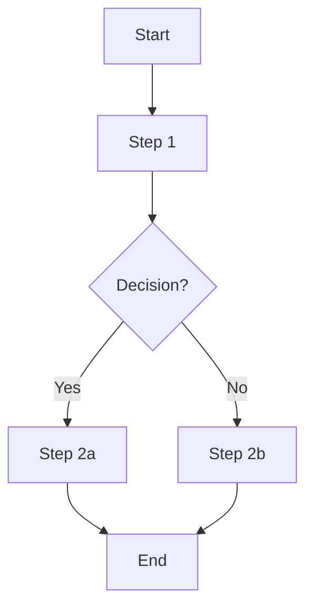
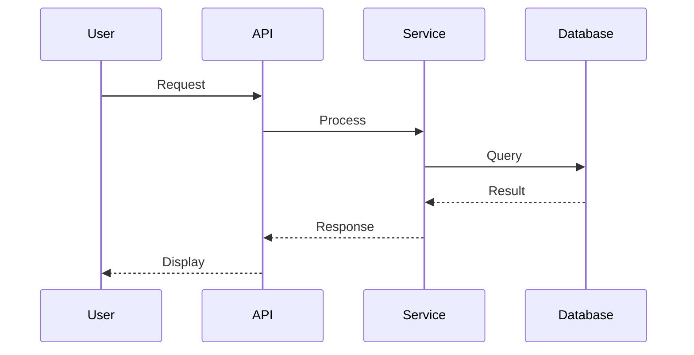
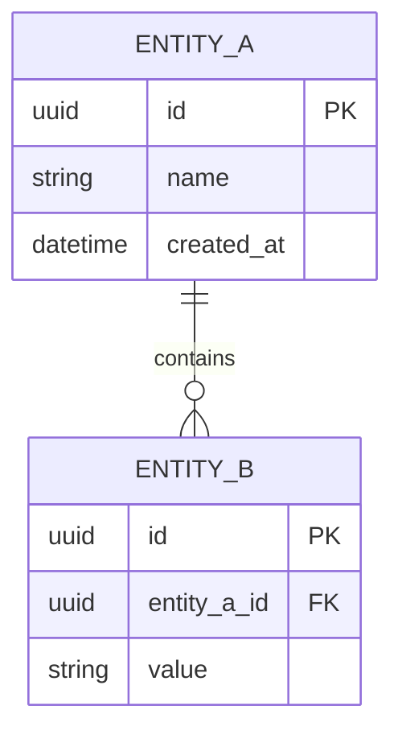

# Specification Template

Use this template when creating feature specifications with the `/specify` command.

---

## Document Structure

```markdown
# [Feature Name] - Specification

**Created**: YYYY-MM-DD
**Status**: Draft | Review | Approved
**Author**: [Name or AI-assisted]

---

## 1. Overview & Context

### 1.1 Purpose & Business Value

[Why does this feature exist? What problem does it solve?]

### 1.2 Stakeholders

| Stakeholder | Interest | Impact |
|-------------|----------|--------|
| [Role] | [What they care about] | [High/Medium/Low] |

### 1.3 Scope

**In Scope:**
- [What's included]

**Out of Scope:**
- [What's explicitly excluded]

### 1.4 Success Criteria

- [ ] [Measurable criterion 1]
- [ ] [Measurable criterion 2]
- [ ] All tests pass with ≥{coverage_target}% coverage
- [ ] {quality_command} passes

### 1.5 Dependencies

| Dependency | Type | Status |
|------------|------|--------|
| [Component/Service] | [Required/Optional] | [Exists/Needed] |

---

## 2. User Perspective

### 2.1 User Stories

**US-001: [Story Title]**
> As a [role], I want [capability], so that [benefit].

**Acceptance Criteria:**
- [ ] [Criterion 1]
- [ ] [Criterion 2]

---

**US-002: [Story Title]**
> As a [role], I want [capability], so that [benefit].

**Acceptance Criteria:**
- [ ] [Criterion 1]
- [ ] [Criterion 2]

### 2.2 User Workflows

**Workflow 1: [Name]**



**Steps:**
1. User [action]
2. System [response]
3. User [action]
4. System [response]

### 2.3 UI/UX Requirements (if applicable)

- [Layout requirements]
- [Interaction patterns]
- [Accessibility needs (WCAG level)]

---

## 3. Behavioral Perspective

### 3.1 Functional Requirements

**FR-001: [Requirement Title]**
- **Description**: [What the system must do]
- **Input**: [Expected input]
- **Output**: [Expected output]
- **Validation**: [Rules that apply]

---

**FR-002: [Requirement Title]**
- **Description**: [What the system must do]
- **Input**: [Expected input]
- **Output**: [Expected output]
- **Validation**: [Rules that apply]

### 3.2 Business Rules

| Rule ID | Description | Enforcement |
|---------|-------------|-------------|
| BR-001 | [Rule description] | [Where/how enforced] |
| BR-002 | [Rule description] | [Where/how enforced] |

### 3.3 System Interactions



### 3.4 Error Handling

| Error Condition | System Response | User Message |
|-----------------|-----------------|--------------|
| [Condition] | [Technical response] | [User-friendly message] |

### 3.5 Edge Cases

| Scenario | Expected Behavior |
|----------|-------------------|
| [Edge case 1] | [How system handles it] |
| [Edge case 2] | [How system handles it] |

---

## 4. Structural Perspective

[See `_templates/architecture-patterns.md` for architecture-specific sections]

### 4.1 Component Model

**Use the pattern that matches your project architecture.**

[Include components based on architecture pattern - see architecture-patterns.md]

### 4.2 Data Model



### 4.3 API Design (if applicable)

**Endpoint: `[METHOD] /api/[path]`**

**Request:**
```json
{
  "field": "value"
}
```

**Response (200):**
```json
{
  "id": "uuid",
  "field": "value"
}
```

**Error Responses:**
| Status | Condition | Body |
|--------|-----------|------|
| 400 | Invalid input | `{"error": "description"}` |
| 404 | Not found | `{"error": "not found"}` |

---

## 5. Implementation Perspective

### 5.1 Technology Stack

| Layer | Technology | Rationale |
|-------|------------|-----------|
| [Layer] | [Tech] | [Why] |

### 5.2 File Structure

```
src/
├── [path]/
│   ├── [file.ext]      # [Description]
│   └── [file.ext]      # [Description]
└── tests/
    └── [test_file.ext] # [Description]
```

### 5.3 Configuration

| Setting | Type | Description | Default |
|---------|------|-------------|---------|
| `SETTING_NAME` | string | [Purpose] | [value] |

### 5.4 Dependencies

**New Dependencies:**
| Package | Version | Purpose |
|---------|---------|---------|
| [package] | [version] | [why needed] |

**Existing Dependencies Used:**
- [package] - [how used]

---

## 6. Non-Functional Requirements

### 6.1 Performance

| Metric | Target | Measurement |
|--------|--------|-------------|
| Response time | < [X]ms | [How measured] |
| Throughput | [X] req/s | [How measured] |

### 6.2 Security

- [ ] [Security requirement 1]
- [ ] [Security requirement 2]
- [ ] No secrets in code
- [ ] Input validation on all endpoints

### 6.3 Scalability

[Growth expectations and how the design accommodates them]

### 6.4 Reliability

- [ ] [Reliability requirement]
- [ ] Error recovery mechanism
- [ ] Graceful degradation

---

## 7. Testing Perspective

### 7.1 Test Strategy

| Test Type | Scope | Tools |
|-----------|-------|-------|
| Unit | [What's tested] | [Framework] |
| Integration | [What's tested] | [Framework] |
| E2E | [What's tested] | [Framework] |

### 7.2 Test Scenarios

**Happy Path Tests:**
- [ ] [Scenario 1]: [Expected outcome]
- [ ] [Scenario 2]: [Expected outcome]

**Error Cases:**
- [ ] [Error scenario 1]: [Expected handling]
- [ ] [Error scenario 2]: [Expected handling]

**Edge Cases:**
- [ ] [Edge case 1]: [Expected behavior]
- [ ] [Edge case 2]: [Expected behavior]

### 7.3 Test Data

| Entity | Fixture | Purpose |
|--------|---------|---------|
| [Entity] | [fixture_name] | [What it tests] |

### 7.4 Coverage Goals

- Minimum: {coverage_target}% for new code
- Target: [X]% overall

---

## 8. Traceability Matrix

| User Story | Requirement | Component | Implementation | Test |
|------------|-------------|-----------|----------------|------|
| US-001 | FR-001 | [Component] | `src/[file]` | `tests/[test]` |
| US-001 | FR-002 | [Component] | `src/[file]` | `tests/[test]` |
| US-002 | FR-003 | [Component] | `src/[file]` | `tests/[test]` |

**Traceability Check:**
- [ ] Every user story maps to requirements
- [ ] Every requirement maps to components
- [ ] Every component maps to implementation files
- [ ] Every implementation has corresponding tests

---

## 9. Implementation Checklist

### Phase 1: Foundation
- [ ] Configuration/settings defined
- [ ] Interfaces/contracts specified
- [ ] Database schema designed

### Phase 2: Core Implementation
- [ ] Domain/business logic implemented
- [ ] Unit tests written and passing

### Phase 3: Integration
- [ ] Adapters/integrations implemented
- [ ] Integration tests passing

### Phase 4: Validation
- [ ] E2E tests passing
- [ ] Performance validated
- [ ] Documentation complete

### Quality Gates
- [ ] {quality_command} passes
- [ ] {test_command} passes
- [ ] Coverage ≥ {coverage_target}%
- [ ] No TODOs in production code

---

## 10. Open Questions & Risks

### Open Questions

| ID | Question | Impact | Owner | Status |
|----|----------|--------|-------|--------|
| Q-001 | [Question] | [High/Med/Low] | [Who] | [Open/Resolved] |

### Assumptions

| ID | Assumption | Risk if Wrong |
|----|------------|---------------|
| A-001 | [Assumption] | [Consequence] |

### Technical Risks

| Risk | Likelihood | Impact | Mitigation |
|------|------------|--------|------------|
| [Risk] | [H/M/L] | [H/M/L] | [Strategy] |

### Decisions Needed

| Decision | Options | Recommendation | Status |
|----------|---------|----------------|--------|
| [Decision] | [A, B, C] | [Recommendation] | [Pending/Made] |

---

## References

- Plan: `_plans/[plan-name].md` (if exists)
- Research: `_research/[research-name].md` (if exists)
- ADRs: `_adr/[relevant-adrs].md`
- External: [Links to external documentation]
```

---

## Section Guidelines

### Overview & Context
- Be concise but complete
- Success criteria must be measurable
- Dependencies should link to other specs if they exist

### User Perspective
- User stories follow standard format
- Workflows show the happy path first
- Include error paths in workflows

### Behavioral Perspective
- Functional requirements are testable
- Business rules are enforceable
- Error handling is comprehensive

### Structural Perspective
- Adapt to project architecture (see architecture-patterns.md)
- Data model matches domain language
- APIs follow project conventions

### Implementation Perspective
- File structure matches project conventions
- Configuration uses project patterns
- Dependencies are justified

### Testing Perspective
- Coverage targets match project standards
- Test scenarios cover requirements
- Test data is realistic

### Traceability
- Every user story traces to tests
- Gaps indicate incomplete specification

---

## Tips

### Keep It Traceable
Every requirement should have a clear path:
```
User Need → Requirement → Component → Code → Test
```

### Be Specific
Bad: "System should be fast"
Good: "API response time < 200ms for 95th percentile"

### Design for Testing
If you can't describe how to test it, the requirement is unclear.

### Use Diagrams
Mermaid diagrams clarify:
- Workflows (flowchart)
- Interactions (sequenceDiagram)
- Data models (erDiagram)
- Component relationships (classDiagram)

### Reference Don't Repeat
Link to existing documentation rather than copying content.
